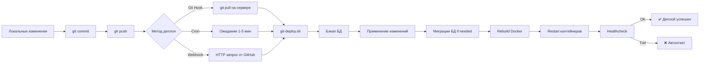

# CI/CD - Автоматический деплой

Полное руководство по настройке автоматического деплоя при изменениях в коде.

## Содержание
1. [Обзор](#обзор)
2. [Методы автодеплоя](#методы-автодеплоя)
3. [Быстрая настройка](#быстрая-настройка)
4. [Workflow](#workflow)
5. [Troubleshooting](#troubleshooting)

---

## Обзор

Система поддерживает 3 метода автоматического деплоя:

| Метод | Триггер | Задержка | Сложность |
|-------|---------|----------|-----------|
| **Git Hook** | `git pull` на сервере | Мгновенно | Простая |
| **Cron Job** | Проверка каждые N минут | 1-5 минут | Простая |
| **Webhook** | Push в GitHub/GitLab | Мгновенно | Средняя |

**Рекомендуется**: Git Hook + Webhook для мгновенного деплоя.

---

## Методы автодеплоя

### Метод 1: Git Hook (Рекомендуется)

**Как работает**: При `git pull` на сервере автоматически запускается деплой.

**Установка на сервере**:
```bash
cd /var/www/medical-news
./deployed/setup-git-hook.sh
```

**Workflow**:
1. На локальной машине: `git push origin main`
2. На сервере: `git pull origin main`
3. Автоматически запускается `git-deploy.sh`
4. Приложение обновляется

**Плюсы**:
- ✅ Простая настройка
- ✅ Работает без внешних зависимостей
- ✅ Полный контроль

**Минусы**:
- ❌ Требует ручной `git pull` на сервере (или cron)

---

### Метод 2: Cron Job

**Как работает**: Каждые N минут проверяет наличие обновлений в git.

**Установка**:
```bash
# Добавить в crontab
crontab -e

# Проверка каждые 5 минут
*/5 * * * * cd /var/www/medical-news && git fetch && git diff --quiet HEAD origin/main || ./deployed/git-deploy.sh >> logs/cron-deploy.log 2>&1
```

**Или через setup-git-hook.sh** (выберите опцию Cron во время установки).

**Workflow**:
1. На локальной машине: `git push origin main`
2. Cron каждые 5 минут проверяет обновления
3. Если есть изменения → автоматический деплой
4. Приложение обновляется (задержка до 5 минут)

**Плюсы**:
- ✅ Полностью автоматический
- ✅ Не требует вебхуков

**Минусы**:
- ❌ Задержка до 5 минут
- ❌ Лишние проверки если обновлений нет

---

### Метод 3: Webhook (GitHub/GitLab)

**Как работает**: GitHub/GitLab отправляет HTTP запрос на сервер при push.

**Установка**:
```bash
cd /var/www/medical-news
./deployed/setup-git-hook.sh
# Выберите опцию "Webhook Endpoint"
```

Это создаст:
- Node.js сервер на порту 9000
- Systemd сервис `webhook-deploy`
- Секретный ключ для проверки подписи

**Настройка в GitHub**:
1. Откройте репозиторий → Settings → Webhooks
2. Add webhook
3. Payload URL: `http://176.124.219.201:9000/deploy`
4. Content type: `application/json`
5. Secret: (ключ из вывода setup-git-hook.sh)
6. Events: Just the push event
7. Active: ✓

**Настройка в GitLab**:
1. Откройте проект → Settings → Webhooks
2. URL: `http://176.124.219.201:9000/deploy`
3. Secret token: (ключ из вывода)
4. Trigger: Push events
5. Add webhook

**Workflow**:
1. На локальной машине: `git push origin main`
2. GitHub/GitLab отправляет webhook
3. Сервер получает запрос → запускает деплой
4. Приложение обновляется (5-10 секунд)

**Плюсы**:
- ✅ Мгновенный деплой
- ✅ Полностью автоматический
- ✅ Работает из любого места

**Минусы**:
- ❌ Требует публичный IP
- ❌ Дополнительный сервис (webhook server)
- ❌ Настройка в GitHub/GitLab

---

## Быстрая настройка

### На продакшн сервере

```bash
# 1. Перейти в проект
cd /var/www/medical-news

# 2. Запустить setup скрипт
./deployed/setup-git-hook.sh

# Ответить на вопросы:
# - Cron job? y
# - Webhook? y (если нужен)

# 3. Проверить что всё работает
tail -f logs/deploy.log
```

### Первый тест

```bash
# На локальной машине
cd /path/to/project

# Сделать небольшое изменение
echo "# Test change" >> README.md
git add README.md
git commit -m "test: auto-deploy"
git push origin main

# На сервере (если используете Git Hook без cron)
cd /var/www/medical-news
git pull origin main

# Проверить логи деплоя
tail -f logs/deploy.log
```

---

## Workflow

### Обычный процесс разработки



### Что происходит при деплое

1. **Проверка изменений**
   - Сравнение коммитов
   - Определение типа изменений

2. **Бэкап БД**
   - Автоматический дамп PostgreSQL
   - Сохранение в `backups/`

3. **Анализ изменений**
   - Изменения в `alembic/versions/` → миграции БД
   - Изменения в `requirements.txt` → полная пересборка backend
   - Изменения в `package.json` → полная пересборка frontend

4. **Применение изменений**
   - `git pull`
   - Копирование конфигов из `deployed/`

5. **Миграции БД** (если нужно)
   - `alembic upgrade head`
   - При ошибке → откат кода и БД

6. **Rebuild Docker**
   - Полный rebuild если изменились зависимости
   - Быстрый rebuild если только код

7. **Restart**
   - `docker-compose down`
   - `docker-compose up -d`

8. **Healthcheck**
   - Проверка backend и frontend
   - При ошибке → автооткат

9. **Уведомление**
   - Логирование в `logs/deploy.log`
   - Telegram уведомление (опционально)

---

## Что деплоится автоматически

### ✅ Всегда деплоится:
- Изменения в backend коде
- Изменения в frontend коде
- Изменения в конфигурации
- Новые миграции БД
- Обновления зависимостей

### ⚠️ Требует подтверждения:
- Критические изменения БД (DROP TABLE и т.д.)
- Изменения в .env (вручную)
- Изменения в nginx (требует sudo)

### ❌ НЕ деплоится автоматически:
- Изменения в SSL сертификатах
- Изменения в системных пакетах
- Изменения в PostgreSQL конфигурации

---

## Troubleshooting

### Деплой не запускается

**Проблема**: После `git push` ничего не происходит

```bash
# Проверка 1: Git hook установлен?
cat .git/hooks/post-merge

# Проверка 2: Cron работает?
crontab -l | grep git-deploy

# Проверка 3: Webhook сервер запущен?
systemctl status webhook-deploy
```

### Деплой падает с ошибкой

**Проблема**: Деплой начинается но завершается с ошибкой

```bash
# Проверить логи
tail -100 logs/deploy.log

# Частые причины:
# 1. Миграция БД failed
grep -i "migration" logs/deploy.log

# 2. Docker build failed
grep -i "build" logs/deploy.log

# 3. Healthcheck не прошёл
docker ps | grep medical-news
docker logs medical-news-backend --tail 50
```

### Автооткат не сработал

**Проблема**: Деплой failed но откат не произошёл

```bash
# Ручной откат
cd /var/www/medical-news

# Узнать предыдущий коммит
git log --oneline -10

# Откатиться
git reset --hard <previous-commit>

# Восстановить БД из бэкапа
ls -lt backups/ | head -5
PGPASSWORD=YOUR_DB_PASSWORD psql -h 172.20.0.1 -U postgres -d news_aggregator < backups/auto_backup_YYYYMMDD_HHMMSS.sql

# Перезапустить контейнеры
docker-compose down
docker-compose up -d
```

### Миграции БД не применяются

**Проблема**: Новая миграция есть но не применилась

```bash
# Проверить текущую версию БД
docker-compose run --rm backend alembic current

# Посмотреть pending миграции
docker-compose run --rm backend alembic history

# Применить вручную
docker-compose run --rm backend alembic upgrade head

# Если ошибка - откатить
docker-compose run --rm backend alembic downgrade -1
```

---

## Безопасность

### Защита webhook

```bash
# Webhook использует секретный ключ
# GitHub проверяет подпись HMAC SHA256
# Только валидные запросы обрабатываются

# Изменить секрет:
# 1. Сгенерировать новый
openssl rand -hex 32

# 2. Обновить в webhook-server.js
# 3. Обновить в GitHub webhook settings
# 4. Перезапустить сервис
sudo systemctl restart webhook-deploy
```

### Ограничение доступа

```bash
# Firewall для webhook порта
sudo ufw allow from GITHUB_IP to any port 9000

# GitHub webhook IPs:
# https://api.github.com/meta
```

---

## Мониторинг

### Логи деплоя

```bash
# Последние деплои
tail -100 logs/deploy.log

# Следить в реальном времени
tail -f logs/deploy.log

# Поиск ошибок
grep -i error logs/deploy.log
grep -i failed logs/deploy.log
```

### Уведомления в Telegram

Добавьте в `.env` на сервере:

```bash
TELEGRAM_BOT_TOKEN=your_bot_token
TELEGRAM_CHAT_ID=your_chat_id
```

Скрипт автоматически отправит уведомление после каждого деплоя.

---

## FAQ

**Q: Можно ли деплоить только backend или только frontend?**
A: Да, скрипт автоматически определяет что изменилось и деплоит только нужное.

**Q: Что если деплой происходит во время активного использования?**
A: Будет downtime 10-30 секунд. Для zero-downtime нужен blue-green deployment.

**Q: Можно ли откатиться на N версий назад?**
A: Да, используйте `git reset --hard <commit>` и восстановите БД из соответствующего бэкапа.

**Q: Как часто делается бэкап БД?**
A: Перед каждым деплоем. Бэкапы хранятся в `backups/`.

**Q: Можно ли пропустить автодеплой для конкретного коммита?**
A: Да, добавьте `[skip ci]` в сообщение коммита.

---

## Контакты

- Документация: `/docs/`
- Логи: `/logs/deploy.log`
- Бэкапы: `/backups/`
